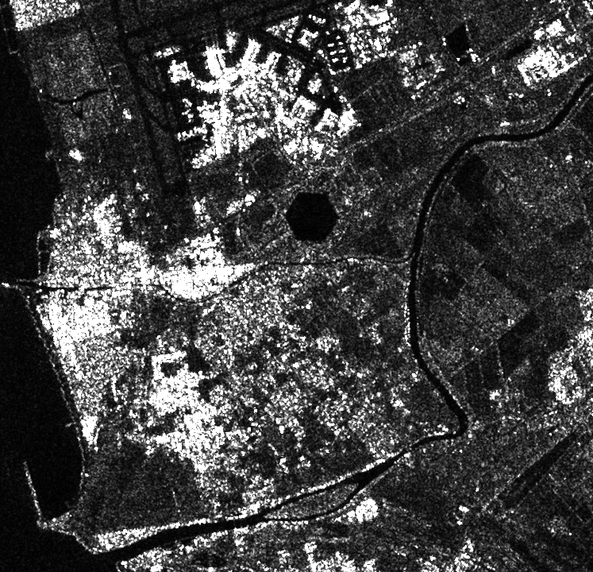

### Two scripts to be used for querying the [Sentinel hub API](https://documentation.dataspace.copernicus.eu/Data/SentinelMissions/Sentinel1.html)

**WARNING:** there is a severe issue with `collect.py` it send way too many queries to the API and consumes your quota. 
#### Setup:

1. You need to establish authentication as described in the [documentation](https://documentation.dataspace.copernicus.eu/APIs/SentinelHub/Overview/Authentication.html#python). Moreover, you need to write these keys into your environment variables in `.env` file.
2. create a [conda](https://conda.io/projects/conda/en/latest/user-guide/getting-started.html) environment: `conda env create -f environment.yml` 
3. activate the environment: `conda activate sent1`
4. run the scripts: `python load_image.py` or **WARNING: this is lethal:** `python collect.py`

